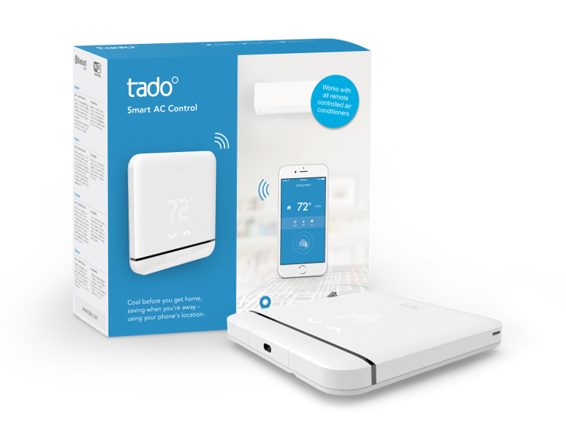

homebridge-tado-ac
========================

[](https://www.npmjs.com/package/homebridge-tado-ac)
[](https://www.npmjs.com/package/homebridge-tado-ac)<br>
<!-- [](https://github.com/homebridge/homebridge/wiki/Verified-Plugins) [](https://discord.gg/yguuVAX)<br> -->
[](https://plugins.hoobs.org?ref=10876) [](https://support.hoobs.org?ref=10876)

Homebridge Plugin for Tado Smart AC Control.



### Requirements

 &nbsp;
 &nbsp;


check with: `node -v` & `homebridge -V` and update if needed


## Installation

This plugin is Homebridge verified and HOOBS certified and can be easily installed and configured through their UI.

If you don't use Homebridge UI or HOOBS, or if you want to know more about the plugin features and options, keep reading...

1. Install homebridge using: `sudo npm install -g homebridge --unasafe-perm`
2. Install this plugin using: `sudo npm install -g homebridge-tado-ac`
3. Update your configuration file. See `sample-config.json` in this repository for a sample.

\* install from git: `sudo npm install -g git+https://github.com/nitaybz/homebridge-sensibo-ac.git`

## Config file

#### Easy config

``` json
"platforms": [
    {
        "platform": "TadoAC",
        "username": "user@name.com",
        "password": "*************"
    }
]
```

#### Advanced config

``` json
"platforms": [
    {
        "platform": "TadoAC",
        "username": "user@name.com",
        "password": "*************",
        "tadoMode": "TIMER",
        "durationInMinutes": 100,
        "manualControlSwitch": true,
        "historyStorage": true,
        "occupancySensorsEnabled": true,
        "occupancyPollingInterval": 10,
        "anyoneSensor": true,
        "weatherSensorsEnabled": true,
        "weatherPollingInterval": 5,
        "disableFan": false,
        "disableDry": false,
        "extraHumiditySensor": true,
        "debug": false,
        "statePollingInterval": 30,
        "homeID": 12345,
        "forceThermostat": false,
        "forceHeaterCooler": false,
        "disableAcAccessory": false
    }
]
```

## Configurations

|             Parameter            |                       Description                       | Required |  Default  |  type  |
| -------------------------------- | ------------------------------------------------------- |:--------:|:---------:|:---------:|
| `platform`                       | always "TadoAC".                                         |     ✓    |      -    |  String  |
| `username`                       | your tado account username (something@something.com).    |     ✓    |      -    |  String  |
| `password`                       | your tado account password.                              |     ✓    |      -    |  String  |
| `tadoMode`                       | default mode for the commands to be sent with. can be "MANUAL" for manual control until ended by the user, "TADO_MODE" for manual control until next schedule change in tado app OR "TIMER" for manual control until timer ends (duration can be set).        |             |  "MANUAL" |
| `durationInMinutes`              |   duration in Minutes for the "TIMER" settings       |            |  90 |
| `manualControlSwitch`       |  Adds switch for getting Manual control status and turn OFF manual control from HomeKit (turn ON is done by sending any command).  |             |  `false` |  Boolean / Array*  |
| `historyStorage` ***new          |  When set to `true`, all measurements (temperature & humidity) will be saved and viewable from the Eve app  |             |  `false`  |   Boolean  |
| `occupancySensorsEnabled`        |  Enable **Occupancy Sensors**.  -*more details below*     |             |  `false` |  Boolean  |
| `occupancyPollingInterval`       |  Time in **Seconds** to check for changes in occupancy. Default is `10` for polling every 10 seconds. minimum is `3`, *it can't be set to `false`!*     |             |  `10` |  Number  |
| `anyoneSensor`       |  Adds 1 **Occupancy Sensor** named "Anyone" to represent the state of someone at home.     |             |  `true` |  Boolean  |
| `weatherSensorsEnabled`          | Enable **Outside Temperature** sensor and **Solar Intensity** light Sensor.  -*more details below*      |             |  `false` |  Boolean  |
| `weatherPollingInterval`         |  Time in **Minutes** to check for changes in weather. Default is `5` for polling every 5 minutes. minimum is `1`, *it can't be set to `false`!*       |             |  `5` |  Number  |
| `disableFan`               |  When set to `true`, it will disable the FAN accessory        |          |  `false` |  Boolean |
| `disableDry`               |  When set to `true`, it will disable the DRY accessory        |          |  `false` |  Boolean |
| `extraHumiditySensor`     |  When set to `true`, it will add extra separate humidity sensor.  |           |  `false` |   Boolean  |
| `debug`       |  When set to `true`, the plugin will produce extra logs for debugging purposes        |          |  `false` |  Boolean  |
| `statePollingInterval`          | Time in seconds between each status polling of the tado devices (set to 0 for no polling)      |             |  `false` |  `false` /  Number |
| `homeID`                       | if not used, the plugin will automatically search for your home ID and store it locally |       |    auto Fetch    |  Number  |
| `forceThermostat`     |  When set to `true`, it will force Homebridge to create Thermostat accessory instead of the HeaterCooler(AC)  |             |  `false` |   Boolean / Array*  |
| `forceHeaterCooler`   |  When set to `true`, it will force Homebridge to create HeaterCooler(AC) accessory instead of Thermostat  |             |  `false` |   Boolean / Array*  |
| `disableAcAccessory`   |  When set to `true`, it will ignore the main AC devices and will only show other options like occupancy sensors/extra humidity sensor/weather sensors   |             |  `false` |   Boolean / Array*  |


### * Specific Device Custom Settings - ###

Some of the config fields allow to set settings for specific devices.

This can be achieved in the config settings ONLY and not through the UI (using the UI plugin settings will erase the custom configurations).

To customize specific device, you'll need to add the device/zone ID or name to the desired config field in an **array**, see the following examples:

`"disableFan": ["Living Room"]` (Single zone with name)

`"disableFan": [1, 2]` (2 zones with ids)

`"disableFan": [1, "Kids Room"]` (2 zones mixed id and name)

`"disableFan": true` (For All)

`"disableFan": false` (For None)

Supported fields: 

- `manualControlSwitch`
- `disableFan`
- `disableDry`
- `extraHumiditySensor`
- `forceThermostat`
- `forceHeaterCooler`
- `disableAcAccessory`


### State Polling (V3 and newer)

 This new options gives a lot more then meets the eye. Setting a state polling interval will fetch the device state every X seconds bringing: relative humidity, room temperature, device full state.
 
 Polling for state gives you the ability to set different automations based on thr changing room temperature or humidity levels. You can even set automations based on different changes of state on your device.
 (Most of those automations can only be achieved with 3rd party apps like EVE)

 For Example:

- Set The Living Room AC to "Heat" when temperature drops below 20ºC
- Set the Bedroom Fan to ON when Humidity is Over 70%
- Turn off Bedroom Lights when Bedroom Tado turns off (that way you can set the Tado device to manually control other devices)

To set State Polling add `"statePollingInterval": time_in_seconds` to your config and change the time_in_seconds to your choice, depends on your automations needs (I recommend to set it to something between 5-10).

State Polling is also great to increase the loading speed of your Homebridge accessories. If you felt like it takes a few seconds to load all your accessories in Home app, this should return the status instantly as the status is always fetched from the devices.

### Thermostatic Control (V3 and newer)

Thermostatic Control is finally supported in Version 3!
Now, when the plugin recognize that your device is on thermostatic control it will create a thermostat accessory in HomeKit instead of the HeaterCooler(AC) Service, This will disable the fan, fan speed & swing abilities but give you more natural control over the device.

If you're interested in thermostat accessory even in non-thermostatic control, it can be achieved with the new feature "Force Thermostat", just add `"forceThermostat": true` to your config or set it only for specific devices this way:
`"forceThermostat": [2, 5, 8]`
or
`"forceThermostat": ["Living Room", "Kids Room"]`

### Humidity Sensor (V3 and newer)

In V3,the humidity sensor is part of the main accessory AC/Thermostat and no longer created as a separate sensor. this helps to create a better and clean interface without any unnecessary accessories while maintaining the options to get the state from Siri, set automations and view the humidity state in the device settings. 

If you're interested in getting the extra humidity sensor back, it can be achieved with the new feature "Extra Humidity Sensor", just add `"extraHumiditySensor": true` to your config or set it only for specific devices this way:
`"extraHumiditySensor": [2, 5, 8]`
or
`"extraHumiditySensor": ["Living Room", "Kids Room"]`

### Outside Temperature & Solar Intensity Sensors

 Enabling this feature will add 2 new accessories to your home:

***All data is gathered from Tado API and is related specifically to your homes.***

**Outside Temperature** - Temperature sensor that will show you the temperature outside of your home area.

**Solar Intensity** - Light bulb accessory that will show you the relative(%) brightness of the sun in your home area. will go off when it's dark.

Those accessories are great for setting automation based on the weather condition, for example:
- When the first person arrive, If **Outside Temperature** is lower than 18ºC, Then, Turn on the heat.
- When **Solar Intensity** is off, Then, Turn on the Hall Lights & close Blinds.
- When **Solar Intensity** is lower then 20%, Then, Turn on the Garden Lights.

When setting automations that are based on these sensors, it's best to set a polling interval value so that the system will update HomeKit for any changes in weather every X minutes. I recommend to set it to 10 (for every 10 minutes).

When there are no automations based on those sensors it's best to set it to false (or remove from config) so it would be easier on the machine. That way, the status for the sensors will be retrieved only when the app is opened

### Occupancy Sensors
Enabling this feature will add **Occupancy Sensors** for each user signed up to your Tado home (and enabled location services on their device).
If not set otherwise, the system will check for the status every 10 seconds.

**"Anyone"** Sensor will be added automatically to easily automate actions when the first person arrives home or the last person leaves. this is a better alternative to Home App Arrive/Leave automations since this will not require approval for triggering automation. to remove this accessory, set `anyoneSensor` to false

### Cached Settings
Since version 3.2 the plugin will auto cache the settings/capabilites of your Tado device and use them later if the device fails to fetch/sync new settings when homebridge loads.

Using the feature **cachedSettingsOnly** will allow you to you lock the current settings so the plugin will not even try to get new settings once he has it. this will result in faster homebridge loading time but will prevent homebridge from getting new configurations from Tado (new users, thermostatic/non-thermostatic change, change of AC capabilites).

if you're using this method, make sure to change the `cachedSettingsOnly` option to `false` if you made any change in Tado app and want it to be applied in HomeKit


## Updates

### Whats New in Version 3 ??

This version was built from scratch to bring you a lot more options and control over your Tado device & air conditioner with HomeKit:

1. Optimize code to bring you **faster loading speed, faster response and compatibility with all Tado states.**
2. **THERMOSTATIC Control** is finally supported!! Now, whenever you set your Tado device to Thermostatic control, your accessory in HomeKit will become a Thermostat to give it more natural feel (No Fan speed & swing are supported in Thermostatic Control).
3. **Force Thermostat** - set 'forceThermostat' in the config to use Thermostat accessory even with Non-Thermostatic control.
4. **State Polling** is now available! state polling will help you achieve automations based on your humidity, temperature or Tado state. it also helps to load device status instantly as the state is taken regularly from the device.
5. Humidity Sensor is now part of the HeaterCooler Service(AC) and now appear only in the accessory settings and not as a separate accessory. this move was meant to prevent unnecessary accessory in HomeKit when some can be joined together. if you still prefer to see th humidity sensor as a separate accessory it can be done by adding `"extraHumiditySensor": true` to your config.
6. **Settings for individual device** - some of the config options are now available to be set for specific devices. that can be achieved by sending an array of device name or zone ID (if known)
7. Changed config names: <br>
    manualControl => manualControlSwitch<br>
    autoOnly => autoFanOnly


**version 2.3:**
1. Added option to disable the humidity sensors (if you're tracking the humidity with another device).
2. Added option to disable the fans (if you're using other fans)
3. Fixed API issues (using token)


**version 2.2:**
1. Added support for "TIMER" Tado mode to set each command with a timer.
2. Manual Control Switch - to turn off "Manual Control" if needed.
3. *Extra Temperature Sensor - for Temperature Sensor in a different accessory. (deprecated)*
4. Added support for "AUTO" fan speed.
5. Solved crashing homebridge when API is down.


**version 2:**
1. Homebridge plugin turned into platform to support 1 eco-system.
2. Device auto detection - the plugin automatically detects and adds any Tado AC device.
3. HomeKit air conditioner support.
4. Support for ***Swing*** and ***Rotation Speed*** of the air conditioner.
5. Fan Support - as different accessory.
6. Auto configuration - The plugin detects the capabilities of your AC (set by Tado) and set them up accordingly in HomeKit:
    - Zone Id
    - Home Id
    - Min/Max Temperature
    - Modes (AUTO/COOL/HEAT/FAN)
    - Temperature Unit
    - Swing
    - Rotation Speeds
7. Humidity sensor as a separated accessory.
8. Much faster status update - makes the accessories load much faster in Home app.
9. Easy config - Only username and password are required now to enjoy all features.
10. Outside Temperature support.
11. Solar Intensity support.
12. Occupancy Sensors.


This version does not support lower version then iOS 11,
To use old version feel free to install from [GitHub](https://github.com/nitaybz/homebridge-tado-ac-old):
`sudo npm install -g https://github.com/nitaybz/homebridge-tado-ac-old.git`


## Troubleshooting

- Auto mode in the home app will show middle 25ºC, but because Tado app does not support temperature for Auto mode, changing the temperature will not change anything in Tado.

- HomeKit Cooling or Heating mode while in Auto Mode is set by evaluation I'm making with the room temperature so no promises there.

- There might be an issue with Fahrenheit degrees on the thermostat accessory cause I haven't tested it yet... if it does, please let me know

- Rotation speed support every speed but not Auto speed since there is no option for that in HomeKit - therefor when rotation speed is set to Auto through Tado app it will just show low speed in home app.

- If the plugin can't detect your AC installation properly (**Thermostatic/Non-Thermostatic**), that is probably because the Tado API is not updated with your recent change. you can force it to be the type oif device you want by using `forceHeaterCooler` or `forceThermostat`.

- You might see errors like 
```Initializing platform accessory 'Living Room Tado'... HAP Warning: Characteristic 00000025-0000-1000-8000-0026BB765291 not in required or optional characteristics for service 0000004A-0000-1000-8000-0026BB765291. Adding anyway...```
<br> You can ignore these errors as those are cause by adding unnatural Characteristics like the humidity sensor to the HeaterCooler or the On Characteristic to the Thermostat.

I tried my best to make this version flawless, but expect some issues since each user has his own different setup.
Once a new issue is noticed, please submit to [Issues](https://github.com/nitaybz/homebridge-tado-ac/issues)


### History Storage
Enabling this feature will keep all measurements of temperature and humidity and will store them. Then, all the historic data will be viewable in Eve app under the accessory in a nice graph.

**To enable the history storage feature**, add 
`"enableHistoryStorage": true` to your config.

### Fan speeds & "AUTO" speed
Fan speed steps are determined by the steps you have available in the Sensibo app. Since HomeKit control over fan speed is with a slider between 0-100, the plugin converts the steps you have in the Sensibo app to values between 1 to 100, when 100 is highest and 1 is lowest. if "AUTO" speed is available in your setup, setting the fan speed to 0, should actually set it to "AUTO" speed.

### Issues & Debug
If you experience any issues with the plugins please refer to the [Issues](https://github.com/nitaybz/homebridge-sensibo-ac/issues) tab or [Sensibo-AC Discord channel](https://discord.gg/yguuVAX) and check if your issue is already described there, if it doesn't, please create a new issue with as much detailed information as you can give (logs are crucial).<br>

if you want to even speed up the process, you can add `"debug": true` to your config, which will give me more details on the logs and speed up fixing the issue.

<br><br>

## Support homebridge-tado-ac

**homebridge-tado-ac** is a free plugin under the MIT license. it was developed as a contribution to the homebridge/hoobs community with lots of love and thoughts.
Creating and maintaining Homebridge plugins consume a lot of time and effort and if you would like to share your appreciation, feel free to "Star" or donate. 

<a target="blank" href="https://www.paypal.me/nitaybz"></a><br>
<a target="blank" href="https://www.patreon.com/nitaybz"></a><br>
<a target="blank" href="https://ko-fi.com/nitaybz"></a>